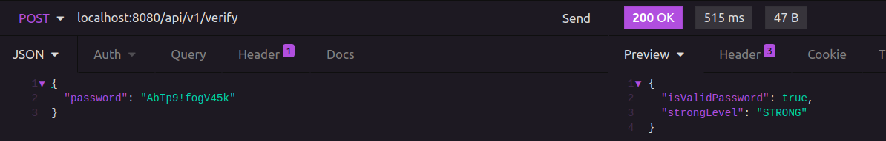
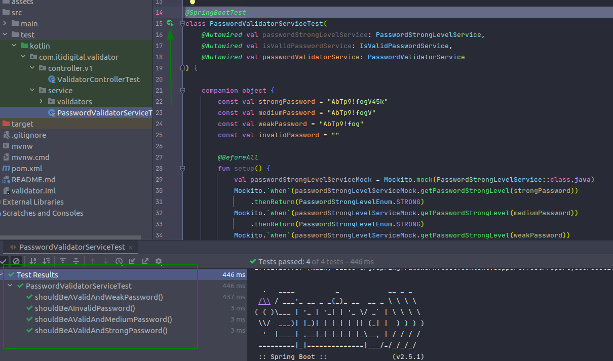

## Password Validator

    This app was built to verify that a password is valid and its level of security

### Project structure

    This project has a simple folder structure, so everyone that will work along on this project
    should understand at first look.

> controller -> Where our endpoint are located, also where the validation for the incoming payload (validation was not treated in this project) </br>
> domain -> Where our models/entities are located, they will abstract and structure all the data of the application </br>
> dtos -> Responsible to how the incoming data should be structured </br>
> service -> Where we are going to connect the incoming data, apply some logic to it and return the result based on our models</br>


### Showcase

**Execute the app using InteliJ or another smart IDE for java/kotlin** </br>

- **When the app is running, execute the code below on the terminal to get a response from the verification for the password:** **AbTp9!fogV45k**

```zsh
curl --request POST \
  --url http://localhost:8080/api/v1/verify \
  --header 'Content-Type: application/json' \
  --data '{
    "password": "AbTp9!fogV45k"
  }'
```

- **An alternative way is to run a POST method on Insomnia or Postman for the url: **http://localhost:8080/api/v1/verify** using the following data:**

```json
{
  "password": "AbTp9!fogV45k"
}
```

</br>

- **An example of how to make a request using Insomnia:** </br>



</br></br>

- **There are tests to ensure validation, and to prove that just run one of them on InteliJ as shown the image below:** </br>


